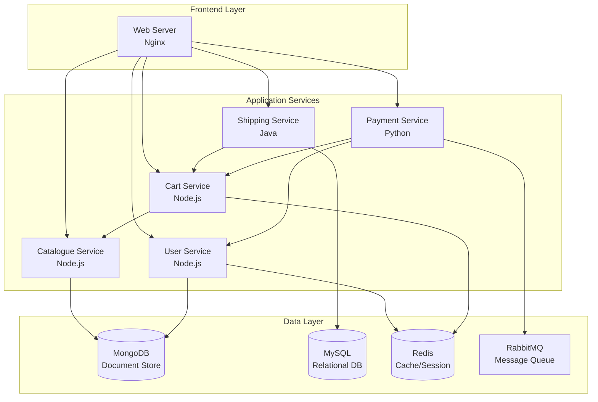

# 🚀 RoboShop: Automated Multi-Service E-commerce Platform

**One-click microservices deployment that scales like magic** ✨


RoboShop is a fully automated, production-ready microservices e-commerce platform that I built to demonstrate enterprise-level DevOps practices. With a single command, you can deploy an entire distributed system comprising 8 interconnected services, complete with databases, message queues, and a responsive web frontend.

## 🎯 The "Why" - Problem & Purpose

**The Challenge:** Setting up complex microservices architectures manually is time-consuming, error-prone, and doesn't scale across different environments. Most learning projects focus on single applications, but real-world systems require orchestrating multiple services with different tech stacks.

**My Solution:** I created RoboShop to bridge this gap - a complete e-commerce ecosystem that showcases:
- **Infrastructure as Code** principles with automated shell scripts
- **Polyglot architecture** using Node.js, Java, and Python services
- **Database diversity** with MongoDB, MySQL, and Redis
- **Production-ready practices** including service users, systemd integration, and proper logging

**Why I Built This:** As a passionate DevOps learner, I wanted to create something that demonstrates not just coding skills, but systems thinking, automation mindset, and enterprise architecture understanding. This project simulates real-world complexity while maintaining simplicity in deployment.

## 🛠️ Tech Stack & Architecture

### Core Technologies
- **Frontend:** Nginx (Reverse Proxy + Static Content)
- **Backend Services:** Node.js, Java (Spring Boot), Python (Flask)
- **Databases:** MongoDB, MySQL 5.7, Redis 6.2
- **Message Queue:** RabbitMQ with Erlang
- **Automation:** Bash scripting with error handling
- **Service Management:** systemd

### System Architecture



## 🚀 Getting Started

### Prerequisites
- **Operating System:** RHEL/CentOS 8+ or Amazon Linux 2
- **Access:** Root privileges required
- **Network:** Internet connectivity for package downloads
- **Resources:** Minimum 4GB RAM, 20GB disk space

### Installation

1. **Clone the Repository**
   ```bash
   git clone https://github.com/yourusername/roboshop-shell.git
   cd roboshop-shell
   ```

2. **Set Execution Permissions**
   ```bash
   chmod +x *.sh
   ```

3. **Deploy Infrastructure Services** (Execute in order)
   ```bash
   # Database Layer
   sudo ./02-mongodb.sh
   sudo ./04-mysql.sh
   sudo ./06-redis.sh
   sudo ./05-rabbitmq.sh
   
   # Application Services
   sudo ./08-catalogue.sh
   sudo ./10-cart.sh
   sudo ./12-user.sh
   sudo ./14-shipping.sh
   sudo ./16-payments.sh
   
   # Frontend
   sudo ./18-web-roboshop.sh
   ```

4. **Verify Deployment**
   ```bash
   # Check all services status
   systemctl status catalogue cart user shipping payment nginx
   
   # Test connectivity
   curl -I http://your-server-ip
   ```
   
## 💡 My Learning Journey & Key Takeaways

**Key Technical Insights I Gained:**

1. **Service Discovery Patterns:** Understanding how microservices find and communicate with each other in production environments
2. **Configuration Management:** Learning the importance of externalized configuration for different deployment environments
3. **Dependency Injection:** Realizing how environment variables enable loose coupling between services
4. **Error Handling in Automation:** Building robust validation functions that fail fast and provide clear feedback

**Skills This Experience Developed:**
- **Systems Thinking:** Understanding how individual components form cohesive systems
- **Debugging Distributed Systems:** Learning to trace issues across multiple services and logs
- **Infrastructure Automation:** Writing maintainable scripts with proper error handling and logging
- **Production Readiness:** Implementing practices like service users, systemd integration, and structured logging

This challenge taught me that in DevOps, the technical solution is often just 30% of the problem - the other 70% is understanding system behavior, anticipating failure modes, and building for maintainability. It's what sparked my deeper interest in container orchestration and service mesh technologies.

---

## 📁 Project Structure

```
roboshop-shell/
├── 01-mongo.repo          # MongoDB repository configuration
├── 02-mongodb.sh          # MongoDB installation & setup
├── 03-mysql.repo          # MySQL repository configuration  
├── 04-mysql.sh            # MySQL installation & setup
├── 05-rabbitmq.sh         # RabbitMQ installation & setup
├── 06-redis.sh            # Redis installation & setup
├── 07-catalogue.service   # Catalogue service systemd unit
├── 08-catalogue.sh        # Catalogue service deployment
├── 09-cart.service        # Cart service systemd unit
├── 10-cart.sh             # Cart service deployment
├── 11-user.service        # User service systemd unit
├── 12-user.sh             # User service deployment
├── 13-shipping.service    # Shipping service systemd unit
├── 14-shipping.sh         # Shipping service deployment
├── 15-payment.service     # Payment service systemd unit
├── 16-payments.sh         # Payment service deployment
├── 17-roboshop.conf       # Nginx reverse proxy configuration
└── 18-web-roboshop.sh     # Web frontend deployment
```

## 🔧 Advanced Configuration

### Custom IP Configuration
Update the IP addresses in service files to match your infrastructure:

```bash
# For distributed deployment across multiple servers
sed -i 's/172.16.100.5/YOUR_MONGODB_IP/g' *catalogue.service
sed -i 's/172.20.1.110/YOUR_REDIS_IP/g' *cart.service *user.service
```

### Monitoring & Logs
```bash
# Service logs
journalctl -u catalogue -f
journalctl -u cart -f

# Application logs
tail -f /tmp/*.log
```

## 🎯 What Makes This Project Special

- **Production-Ready Architecture:** Uses systemd, proper service users, and structured logging
- **Polyglot Demonstration:** Showcases proficiency in multiple programming languages and databases
- **Infrastructure as Code:** Everything is automated and reproducible
- **Error Handling:** Comprehensive validation and rollback mechanisms
- **Scalability Mindset:** Environment-based configuration ready for containerization

---

*"Great software is built by those who understand that technology serves people, not the other way around."* 

This project represents my journey in understanding distributed systems, automation, and the beautiful complexity of modern software architecture. Every script, every configuration file, and every service interaction was crafted with care and attention to detail.